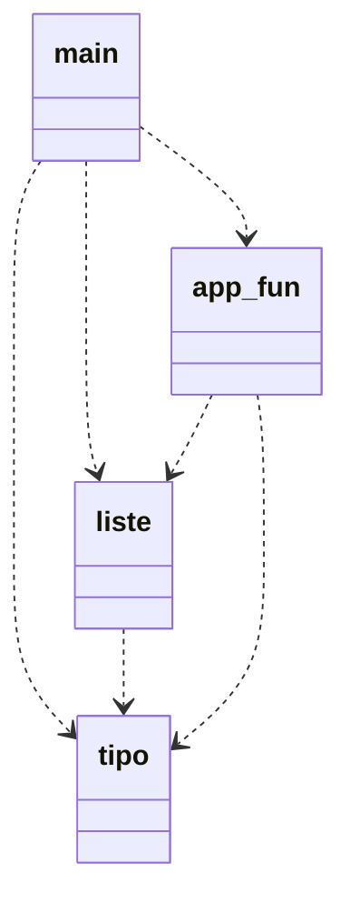

# File header
I file header contengono l'interfaccia del modulo a cui fanno riferimento. Vengono importati con la direttiva `#include`, eseguita dal preprocessore.

## Parte privata di un modulo
La keyword `static` forza il collegamento interno (internal linking) di un particolare identificatore.

Strutture dati condivise tra più file non possono essere rese private, tantomeno parzialmente private.
Non esiste nessun meccanismo, a livello di linguaggio, che vieti di usare campi privati di una struttura dati; l'unico modo per fare questo è utilizzare i commenti per documentare con precisione quali campi sono privati e quali sono pubblici.

## Classi
Il C++ è anche un linguaggio object-oriented, nonostante venga usato nel corso solo nella sua declinazione procedurale. Il blocco fondamentale `class`, che permette di definire un nuovo tipo di dato, l'interfaccia e l'implementazione di ogni metodo. I metodi di un oggetto di tipo class operano implicitamente sui campi dell'oggetto stesso.

Con questo meccanismo è possibile definire campi pubblici e campi privati: cosa voglio esporre e cosa non voglio che sia utilizzato all'esterno. I metodi della classe possono accedere a tutti i dati contenuti nella classe.

Non abbiamo ancora raggiunto l'obiettivo 2: separazione tra tipo di dato e funzioni che operano su questo tipo di dato &rarr; non abbiamo realizzato una lista in grado di essere indipendente dal tipo di dato contenuto.

## Possibile soluzione
Viene introdotto il tipo di dato `tipo_inf` -> tipo dell'informazione. Stiamo astraendo perchè non teniamo in considerazione quale sarà il tipo di dato contenuto nella lista.

Aggiungiamo al nostro progetto il modulo _tipo_, che contiene:
 - definizione di `tipo_inf`
 - primitiva `int compare(tipo_inf, tipo_inf)` per confrontare due valori, che ritorna:
    - 0 se v1 = v2
    - <0 se v1 < v2
    - \>0 se v1 > v2
    
    In questo modo ho definito l'interfaccia di `compare`, ma astraggo dall'implementazione. All'interno del modulo _liste_ userò questa funzione.
 - primitiva `void copy(tipo_inf&, tipo_inf)` che copia in contenuto del secondo parametro nel primo parametro (descrizione funzionale).
 - primitiva `void print(tipo_inf)` stampa il valore del dato passato.

Il modulo _liste_, che contiene le primitive per operare sulle liste (non più liste-tipo), è diventato indipendente dal tipo di dato memorizzato nella lista.

### Esempio
Nella primitiva `search` sostituisco:
```c
...
if (strcmp(head(l), val) == 0)
...
```
con
```c
...
if (compare(head(l), val) == 0)
...
```

## Nuovo schema logico


Abbiamo raggiunto l'obiettivo 2: 2 moduli separati tra loro (_liste_, _tipo_) che sono indipendenti dal tipo di dato memorizzato nella lista. L'implementazione del modulo _tipo_ è trasparente a chi lo usa, perchè non importa l'implementazione di print e compare.

## Esercizi
 - a partire da _progetto\_multifile_ rivedere il progetto usando il nuovo schema logico (aggiunta modulo tipo)

# Compilazione
Problemi: dover enumerare tutti i file che si vogliono compilare come parametri di g++, ricompilare tutto da capo.

## Compilazione separata
La compilazione di un progetto comprende più fasi separate:
INPUT       | FASE            | OUTPUT
source file -> preprocessing -> translation unit
translation unit -> translation -> object file
object files -> linking -> executable

Il file oggetto è dipendente dall'architettura.

Il termine _compilazione_ viene usato in modo ambigo per riferirsi a:
 - generazione di un file oggetto (preprocessing e traduzione)
 - generazione di un eseguibile (tutte e 3 le fasi)

## Preprocessing
Dato un file sorgente la prima passata è effettuata dal preprocessore. Svolge 3 compiti:
 - inclusione file (`include`)
 - definizione di macro (`define`)
- compilazione condizionale (`ifdef`, `ifndef`)

Al termine di questa operazione si ottiene un testo, detto _unità di traduzione_.

### Define
Direttiva al preprocessore: `#define` -> permette di definire macro con o senza parametri (uno o più) e macro vuote.

È una mera sostituzione di "caratteri" all'interno del codice sorgente.

Esempi:
```c
#define ID 5

#define NAME "file.cpp"

#define INC(a) (a)++  // servono parentesi aggiuntive perchè avviene una sostituzione carattere per carattere

#define PRINT_MAX(a, b) if ((a) > (b)) \
                           cout << (a); \
                        else \
                           cout << (b);  // una macro deve svilupparsi su una sola riga

#define ID  // a partire da questo punto del codice viene eliminata la sequenza di caratteri "ID" ed eliminarla, ma da questo punto in poi ID è definito come macro
```
Nota: ricordati di usare parentesi per "proteggere" l'argomento di un define.

### Ifdef
Significa "if defined". Controlla se un identificatore è stato definito.

Esempio:
```c
#ifdef identificatore
   codice
[#else
   codice 2
[#elif
   codice 3]
]
#endif
```

## Compilazione condizionale
La l'identificatore è definito, _codice_ viene lasciato nella translation unit, altrimenti viene eliminato.

Questi identificatore vengono compilati in sequenza; viene eseguito il codice del primo identificatore come macro, se esiste. Attraverso la definizione di identificatore posso decidere quale porzione di codice eseguire.

Utilizzato per fare girare codice multipiattaforma.

Esempio:
```c
#define UGO

int main() {
   cout << "Hello" << endl;

   #ifdef UGO
      cout << "UGO defined" << endl;
   #else
      cout << "UGO not defined" << endl;
   #endif
}
```

Queste operazioni vengono fatte al momento del preprocessing perchè in questo modo faccio arrivare al compilatore una translation unit pulita.

Utilizzo tipico: codice di debug -> istruzioni per debugging incapsulate dentro all'ifdef
```c
#ifdef DEBUG
   // stampe di debug
#endif
```

Esempio: mantenere il codice retrocompatibile
```c
#ifdef TABLE_SIZE
   int table[TABLE_SIZE];
#else
   cin >> dim;
   int *table = new int[dim];
#endif
```

Esempio: scrivere programmi portabili su diverse macchine
```c
#ifdef _WIN64
   // includo librerie per windows
#elif _LINUX
   // includo lib linux
#endif
```

### Ifndef
Entra se la macro **non** è definita.

Esempio: include guard
```c
#ifndef CLASS_H
#define CLASS_H
// code
#endif
```

Cosa succede se non li utilizzo? Se ad esempio includo _iostream_ in due file, senza usare le include guards, avrei un conflitto di identificatori e una dimensione più grande della translation unit.

## Programma su più file
Dato un programma costituito su più file sorgente, vogliamo un unico eseguibile. Concorre a formare l'eseguibile qualsiasi libreria/modulo che viene usato all'interno del main.

Esempio: includo una libreria che non suo -> preprocessata, compilata ma non linkata

Dopo il preprocessing abbiamo la fase di traduzione; ogni **unità di traduzione** è tradotta in *isolamento*. Non si può ottenere un eseguibile completo a partire da un solo file oggetto.

## File oggetto
La translation unit viene tradotta in un **file oggetto**: un file binario ma non eseguibile (stesso formato di un eseguibile completo, programma in linguaggio macchina), ma è un programma incompleto perchè fa riferimento ad oggetti riferiti altrove. La translation unit contiene le dichiarazioni dei simboli usati all'intenro del progetto e "si fida": dà per scontato che gli identificatori sarranno definiti altrove.

All'interno di un file oggetto (e dell'eseguibile) gli identificatori degli oggetti (variabili, costanti, funzioni...) sono chiamati **simboli**.

Quindi, dati i file oggetto ottenuti dalla traduzione delle translation units, abbiamo bisogno di un unico simbolo della funzione main e di tutti i simboli che vengono utilizzati.

## Linking
La fase di collegamento (linking) viene effettuata dal linker (tipicamente *ld*), che collega i file oggetto per formare un unico eseguibile. Inoltre, nei punti del file oggetto in cui viene utilizzato un simbolo non definito nello stesso file oggetto, il simbolo viene sostituito da un riferimento al punto in cui il simbolo è effettivamente definito, in uno degli altri file oggetto. Se il riferimento non viene trovato il linker si arresta.

## Schema riassuntivo della compilazione
Parto con: file1.cpp, file2.cpp, ..., fileN.cpp
Dopo preprocessing e traduzione ho: file1.o, file2.o, ..., fileN.o
Dopo il linking: eseguibile

## Collegamento statico
Per i simboli del nostro progetto su più file avviene il **collegamento statico**. L'alternativa è il **collegamento dinamico**.

## Compilazione separata con gcc
`gcc` è costituito da un insieme di moduli distinti, che si occupano delle varie fasi di compilazioni.
`g++` è un front-end di gcc che invoca automaticamente tutte le componenti di gcc che servono per compilare un programma scritto in C++.

Componenti base:
 1. `cc1plus` per Linux, `clang` in OS X: pre-processing e traduzione in assembly, genera un file *assembly*
 2. `as`: traduttore in linguaggio macchina, genera un *file oggetto*
 3. `collect2`: invocatore del linker, genera un file eseguibile colelgando assieme i file oggetto passati in ingreso (potrei non volere tutti i file oggetto all'interno del mio eseguibile)

### Traduzione
Per fermarmi alla fase di traduzione uso: `g++ -c [options] code.cpp` -> genero un file oggetto (*.o*)
Aggiungi `-v` per la modalità verbose.

### Digressione su cout
Quando scrivo *#include <iostream>* sto includendo in un file le dichiarazioni di identificatori, che fanno riferimento ad oggetto definiti in *iostream*. Il compilatore va a cercare il file tra una lista di direcotry predefinite, visibili con `-v`.

L'operatore `<<` è definito come `operator<<(ostream &...)`.

Lanciando `find /usr/include/c++ -name iostream` troviamo un file in cui *operator<<* non è dichiarato, perchè questa liberia include a sua volta altre librerie.

Il codice sorgente non è visible sul nostro sistema, perchè è già compilato all'interno della libreria standard: *GLIBCXX_3.4* ovvero la librieria (LIB) standard del C++ (CXX) realizzata dalla GNU (G).

L'implementazione si trova in una **liberia condivisa**, che posso individuare con `ldd -v a.out`.

Vedi: *Dependency Walker*

### Linking
Il linker collega i simboli non definiti presenti all'interno del file oggetto all'interno della libreria opportuna. Il linker può collegare diverse liberie in base alla versione.

Per invocare il linker del gcc basta fare: `g++ [-v] hello.o` -> invoca il linker sul file oggetto:
 - `-L` directory delle libreria
 - `-l` nome della liberia

## Collegamento dinamico
Il linker non unisce il file di libreria standard al nostro file oggetto per creare l'eseguibile, ma inserisce nell'eseguible tutte le info per trovare il simbolo desiderato a runtime.

Collegamento statico forzato: `-static`

Un **eseguibile statico** è un eseguible prodotto mediante linking statico alle librerie; un **eseguibile dinamico** è prodotto con linking dinamico.

## Collegamento dinamico e statico a confronto
Il collegamento dinamico ha i seguenti vantaggi:
 - eseguibile di dimensioni minori
 - non si spreca spazio

In ambiente Windows gli oggetti condivisi sono *DLL*, in Linux *SO*

Il collegamento statico ha i seguenti vantaggi:
 - il sistema non deve avere la libreria installata (no dipendenza)

## Sorgenti multipli e liberie
Mettendo insieme quanto visto fin'ora, possiamo utilizzare la **compilazione separata**:
 1. `g++ -c file1.cpp file2.cpp ... fileN.cpp`
 2. `g++ file1.o file2.o ... fileN.cpp`

Che è equivalente a `g++ file1.cpp file2.cpp ... fileN.cpp`

Il linker collega staticamente tutti i file oggetto passati come argomento, appoggiandosi ad un file oggetto temporaneo. Questo file viene linkato dinamicamente alle liberie utilizzate.

## Regole di ricompilazione
Quando abbiamo bisogno di aggiornare un eseguibile?
Se qualche file oggetto cambia.

Quando abbiamo bisogno di aggiornare un file oggetto?
Se il file sorgente cambia, oppure se un qualunque file incluso cambia.

## Ricompilazione selettiva
Se sono cambiati pochi file del mio progetto (anche N-1) non è necessario ricompilare tutti i file, basta ritradurre solo i sorgenti che sono cambiati e il linking (di tutti).

Questo mi permette di velocizzare la fase di compilazione. Infatti la file di linking è molto più veloce della traduzione di file sorgente in file oggetto.

Esempio: per compilare il kernel Linux da zero impiego 14 minuti, se i file oggetto sono tutti pronti impiego 15 secondi.

## Esercizio
[hello_world.cpp](../esercizi/compilazione_separata/hello_world.cpp)