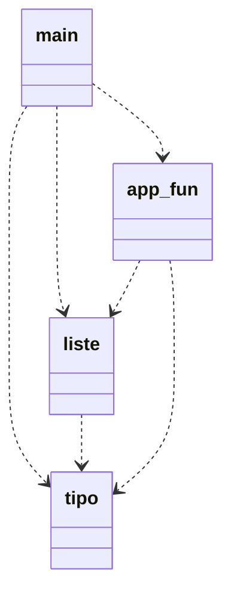

# File header
I file header contengono l'interfaccia del modulo a cui fanno riferimento. Vengono importati con la direttiva `#include`, eseguita dal preprocessore.

## Parte privata di un modulo
La keyword `static` forza il collegamento interno (internal linking) di un particolare identificatore.

Strutture dati condivise tra più file non possono essere rese private, tantomeno parzialmente private.
Non esiste nessun meccanismo, a livello di linguaggio, che vieti di usare campi privati di una struttura dati; l'unico modo per fare questo è utilizzare i commenti per documentare con precisione quali campi sono privati e quali sono pubblici.

## Classi
Il C++ è anche un linguaggio object-oriented, nonostante venga usato nel corso solo nella sua declinazione procedurale. Il blocco fondamentale `class`, che permette di definire un nuovo tipo di dato, l'interfaccia e l'implementazione di ogni metodo. I metodi di un oggetto di tipo class operano implicitamente sui campi dell'oggetto stesso.

Con questo meccanismo è possibile definire campi pubblici e campi privati: cosa voglio esporre e cosa non voglio che sia utilizzato all'esterno. I metodi della classe possono accedere a tutti i dati contenuti nella classe.

Non abbiamo ancora raggiunto l'obiettivo 2: separazione tra tipo di dato e funzioni che operano su questo tipo di dato &rarr; non abbiamo realizzato una lista in grado di essere indipendente dal tipo di dato contenuto.

## Possibile soluzione
Viene introdotto il tipo di dato `tipo_inf` -> tipo dell'informazione. Stiamo astraendo perchè non teniamo in considerazione quale sarà il tipo di dato contenuto nella lista.

Aggiungiamo al nostro progetto il modulo _tipo_, che contiene:
 - definizione di `tipo_inf`
 - primitiva `int compare(tipo_inf, tipo_inf)` per confrontare due valori, che ritorna:
    - 0 se v1 = v2
    - <0 se v1 < v2
    - \>0 se v1 > v2
    
    In questo modo ho definito l'interfaccia di `compare`, ma astraggo dall'implementazione. All'interno del modulo _liste_ userò questa funzione.
 - primitiva `void copy(tipo_inf&, tipo_inf)` che copia in contenuto del secondo parametro nel primo parametro (descrizione funzionale).
 - primitiva `void print(tipo_inf)` stampa il valore del dato passato.

Il modulo _liste_, che contiene le primitive per operare sulle liste (non più liste-tipo), è diventato indipendente dal tipo di dato memorizzato nella lista.

### Esempio
Nella primitiva `search` sostituisco:
```c
...
if (strcmp(head(l), val) == 0)
...
```
con
```c
...
if (compare(head(l), val) == 0)
...
```

## Nuovo schema logico


Abbiamo raggiunto l'obiettivo 2: 2 moduli separati tra loro (_liste_, _tipo_) che sono indipendenti dal tipo di dato memorizzato nella lista. L'implementazione del modulo _tipo_ è trasparente a chi lo usa, perchè non importa l'implementazione di print e compare.

## Esercizi
 - a partire da _progetto\_multifile_ rivedere il progetto usando il nuovo schema logico (aggiunta modulo tipo)

# Compilazione
Problemi: dover enumerare tutti i file che si vogliono compilare come parametri di g++, ricompilare tutto da capo.

## Compilazione separata
La compilazione di un progetto comprende più fasi separate:
INPUT       | FASE            | OUTPUT
source file -> preprocessing -> translation unit
translation unit -> translation -> object file
object files -> linking -> executable

Il file oggetto è dipendente dall'architettura.

Il termine _compilazione_ viene usato in modo ambigo per riferirsi a:
 - generazione di un file oggetto (preprocessing e traduzione)
 - generazione di un eseguibile (tutte e 3 le fasi)

## Preprocessing
Dato un file sorgente la prima passata è effettuata dal preprocessore. Svolge 3 compiti:
 - inclusione file (`include`)
 - definizione di macro (`define`)
- compilazione condizionale (`ifdef`, `ifndef`)

Al termine di questa operazione si ottiene un testo, detto _unità di traduzione_.

### Define
Direttiva al preprocessore: `#define` -> permette di definire macro con o senza parametri (uno o più) e macro vuote.

È una mera sostituzione di "caratteri" all'interno del codice sorgente.

Esempi:
```c
#define ID 5

#define NAME "file.cpp"

#define INC(a) (a)++  // servono parentesi aggiuntive perchè avviene una sostituzione carattere per carattere

#define PRINT_MAX(a, b) if ((a) > (b)) \
                           cout << (a); \
                        else \
                           cout << (b);  // una macro deve svilupparsi su una sola riga

#define ID  // a partire da questo punto del codice viene eliminata la sequenza di caratteri "ID" ed eliminarla, ma da questo punto in poi ID è definito come macro
```
Nota: ricordati di usare parentesi per "proteggere" l'argomento di un define.

### Ifdef
Significa "if defined". Controlla se un identificatore è stato definito.

Esempio:
```c
#ifdef identificatore
   codice
[#else
   codice 2
[#elif
   codice 3]
]
#endif
```

## Compilazione condizionale
La l'identificatore è definito, _codice_ viene lasciato nella translation unit, altrimenti viene eliminato.

Questi identificatore vengono compilati in sequenza; viene eseguito il codice del primo identificatore come macro, se esiste. Attraverso la definizione di identificatore posso decidere quale porzione di codice eseguire.

Utilizzato per fare girare codice multipiattaforma.

Esempio:
```c
#define UGO

int main() {
   cout << "Hello" << endl;

   #ifdef UGO
      cout << "UGO defined" << endl;
   #else
      cout << "UGO not defined" << endl;
   #endif
}
```

Queste operazioni vengono fatte al momento del preprocessing perchè in questo modo faccio arrivare al compilatore una translation unit pulita.

Utilizzo tipico: codice di debug -> istruzioni per debugging incapsulate dentro all'ifdef
```c
#ifdef DEBUG
   // stampe di debug
#endif
```

Esempio: mantenere il codice retrocompatibile
```c
#ifdef TABLE_SIZE
   int table[TABLE_SIZE];
#else
   cin >> dim;
   int *table = new int[dim];
#endif
```

Esempio: scrivere programmi portabili su diverse macchine
```c
#ifdef _WIN64
   // includo librerie per windows
#elif _LINUX
   // includo lib linux
#endif
```

### Ifndef
Entra se la macro **non** è definita.

Esempio: include guard
```c
#ifndef CLASS_H
#define CLASS_H
// code
#endif
```

